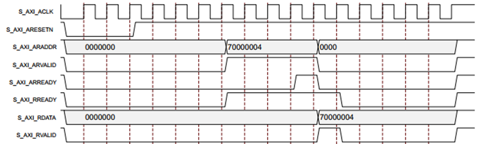
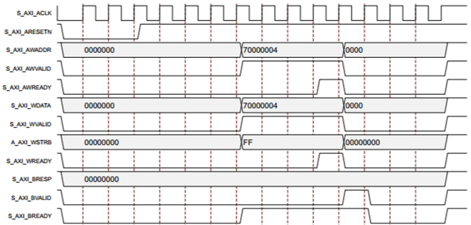

# Introduction

This website contains course materials
for [ECE 4743/6743 – Digital Systems Design](https://github.com/bjones1/MSU-ECE-DSD).
If you see any bugs, please
[report them](https://github.com/bjones1/MSU-ECE-DSD/issues)!

# Resources

## General

- Digilent's
  [Basys 3 board](https://digilent.com/shop/basys-3-artix-7-fpga-trainer-board-recommended-for-introductory-users/)
  and its
  [reference manual](https://digilent.com/reference/programmable-logic/basys-3/start)

## Xilinx

The Basys 3 board contains an
[Artix-7™](https://www.xilinx.com/products/silicon-devices/fpga/artix-7.html)
FPGA (Xilinx part number
[XC7A35T-1CPG236C](https://docs.xilinx.com/v/u/en-US/ds181_Artix_7_Data_Sheet)).
This is a member of Xilinx's 7 series, so documentation on either the 7 series
or on the Artix applies. Start with the
[7 Series FPGAs Overview](https://docs.xilinx.com/v/u/en-US/ds180_7Series_Overview).
Configurable Logic Blocks are the basic building block of FPGAs. Read the
[7 Series FPGAs Configurable Logic Block User Guide](http://www.xilinx.com/support/documentation/user_guides/ug474_7Series_CLB.pdf)
for the essentials of how the 7 series CLBs work. Next, the DSP slices contain
multipliers, adders, and other commonly-used hardware; see the
[7 Series FPGAs DSP48E1 Slice User Guide](http://www.xilinx.com/support/documentation/user_guides/ug479_7Series_DSP48E1.pdf).
These FPGAs also contain RAM; see the
[7 Series FPGAs Memory Resources User Guide](http://www.xilinx.com/support/documentation/user_guides/ug473_7Series_Memory_Resources.pdf).
For more links, see the references on the last page of the
[7 Series Product Tables and Product Selection Guide](https://www.xilinx.com/content/dam/xilinx/support/documents/selection-guides/7-series-product-selection-guide.pdf#page=12).

## Verilog

- The [SystemVerilog standard](SystemVerilog_standard_1800-2017.pdf)
- [Vivado Design Suite User Guide: Synthesis - SystemVerilog Language Support](https://docs.xilinx.com/r/en-US/ug901-vivado-synthesis/SystemVerilog-Support)
- (old)
  See [Flop Inferrence in Verilog Synthesis](https://support.xilinx.com/s/article/1207129?language=en_US)
  for Xilinx's rules on creating flip-flops in Verilog. Briefly: for an async
  set/reset, use `always @(posedge clk or posedge aset_or_clr)`.

## AXI4 bus

Helpful references:

- The
  [AMBA Specifications](https://www.arm.com/architecture/system-architectures/amba/amba-specifications),
  specifically the
  [AMBA AXI and ACE Protocol Specification](https://developer.arm.com/documentation/ihi0022/latest).
- Xilinx's
  [AMBA AXI4 Interface Protocol](https://www.xilinx.com/products/intellectual-property/axi.html)
  provides an overview. They provide a lot of IP cores for AXI4.
- [Xilinx AXI tutorials](https://support.xilinx.com/s/topic/0TO2E000000YNxCWAW/axi-basics-series?language=en_US&tabset-50c42=2)
  (scroll to "Trending articles"), especially
  [AXI Basics 1 - Introduction to AXI](https://support.xilinx.com/s/article/1053914?language=en_US).

AXI4 has separate read and write busses. AXI4 transactions consist of
VALID/READY handshakes.
From [RealDigital](https://www.realdigital.org/doc/a9fee931f7a172423e1ba73f66ca4081)
(see figures 3 and 4, which appear below), a read transaction:

1.  Master: drive address on ARADDR (read address); assert ARVALID (read address
    is valid).
2.  Slave: assert ARREADY (ready for the read address), indicating the slave has
    the read address. Both may now deassert ARVALID and ARREADY.
3.  Slave: drive data on RDATA (read data) and assert RVALID (read data is
    valid).
4.  Master: assert RREADY (ready to read data). In this case, it asserted it
    earlier, saying it's ready as soon as the slave is.
5.  The next rising clock edge completes the transaction. Master may now
    deassert RREADY; slave may deassert RVALID.

A write transaction:

1.  Master: drive address on AWADDR (write address); assert AWVALID (write
    address is valid).
2.  Slave: assert AWREADY (ready for the write address), indicating the it has
    the write address. Both may now deassert AWVALID and AWREADY.
3.  Master: drive data on WDATA (write data); assert WVALID (write data is
    valid).
4.  Slave: assert WREADY (ready for write data), indicating it has the write
    data. Both may now deassert WVALID and WREADY.
5.  Save: drive response on BRESP (write response data) and assert BVALID (write
    response is valid). The response is OK (2 types) or error (2 types).
6.  Master: assert BREADY (ready for write response), indating that it has the
    write response.
7.  The next rising clock edge completes the transaction. Master may now
    deassert BREADY; slave may deassert BVALID.
