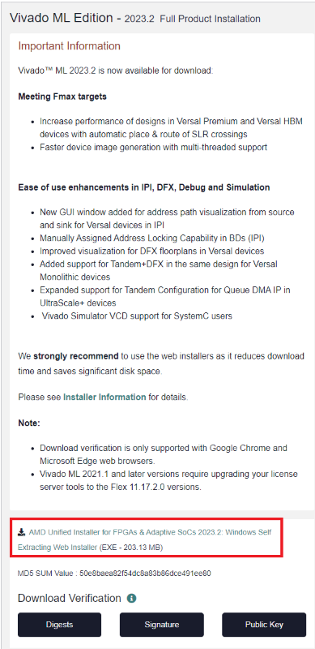
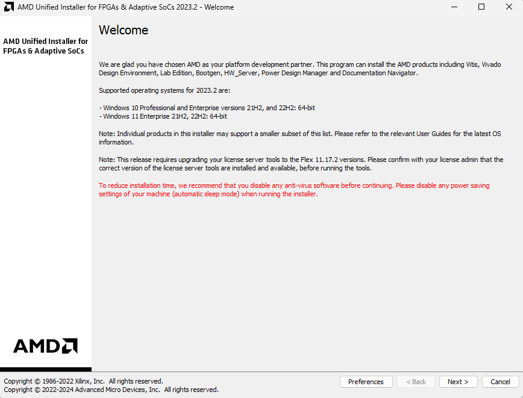
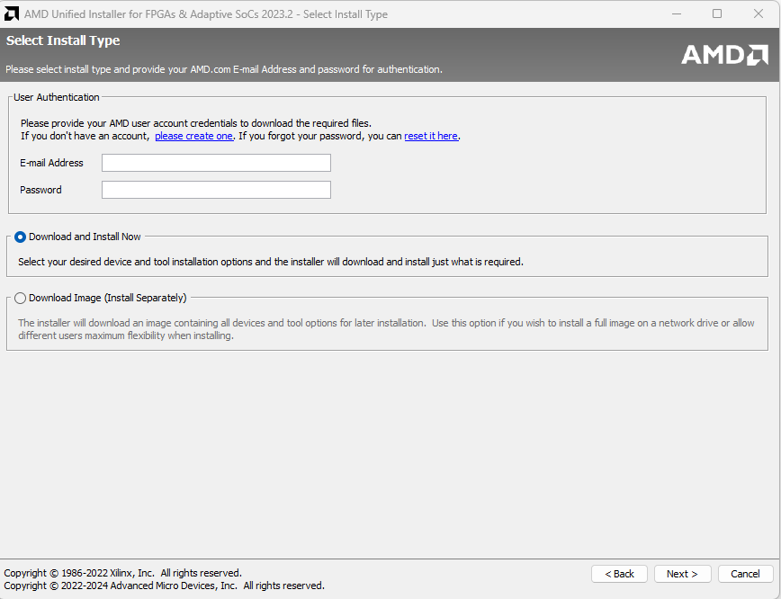
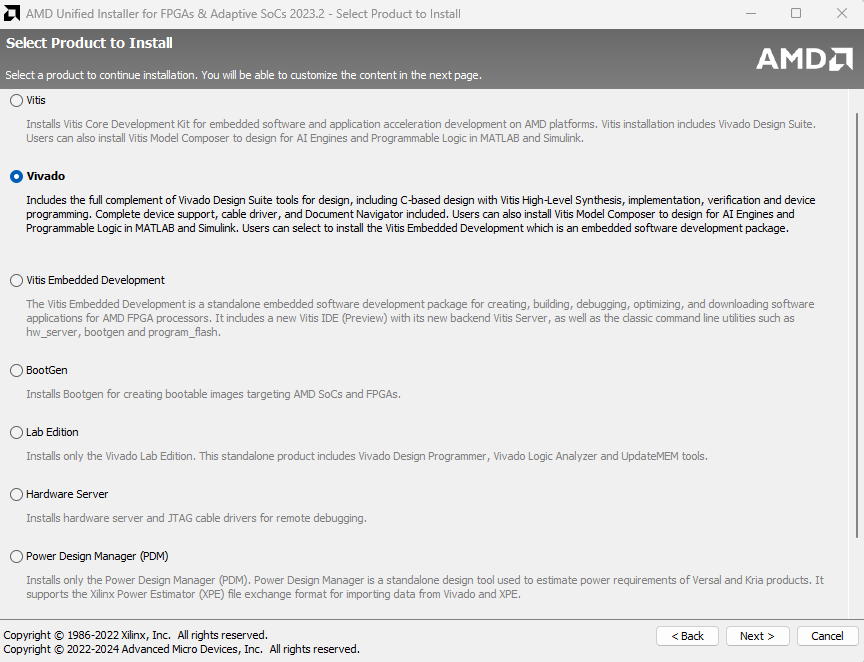
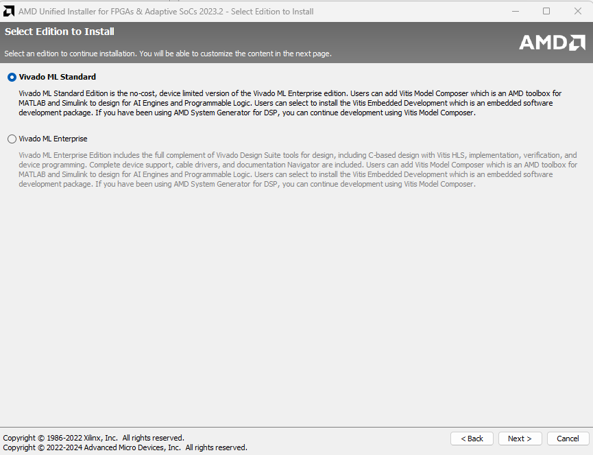
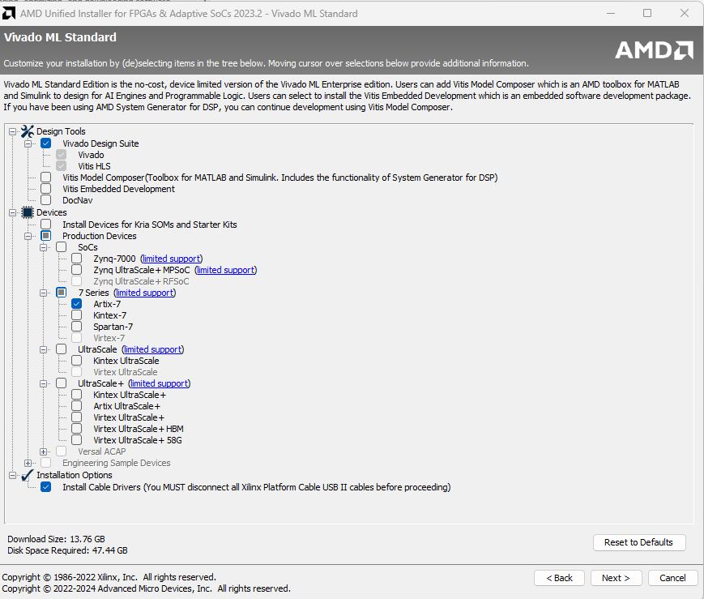
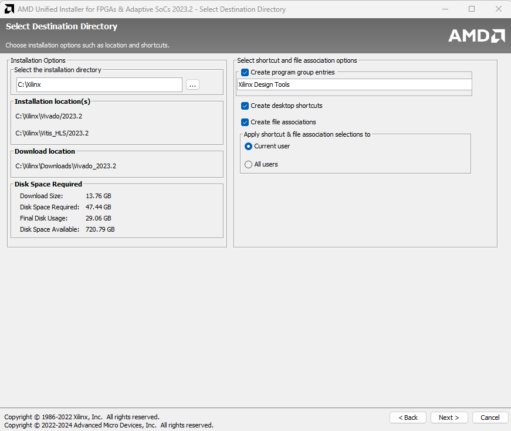

# Vivado Installation Instructions

If you do not already have an account at Xilinx.com, create one – you will need
to use your msstate.edu email address when you fill out the registration form,
as Xilinx is picky about accepting non-institutional addresses.

## Procedure

1.  Go to the [Vivado](http://www.xilinx.com/support/download.html) Website:
    (http://www.xilinx.com/support/download.html)
2.  Select Vivado 2023.2
3.  Download the Vivado HLx 2023.2: Windows Web Installer and execute it. The
    link is shown below.

    

4.  A login prompt will open and then you should login with your account created
    with your school email. Enter your information and the following
    information:\
    Company: Mississippi State University\
    Address: 406 Hardy Road (Simrall)\
    Job Function: Student\
    Then hit the download button found at the bottom of the page.
5.  Run the executable you just downloaded. Allow the windows pop-up if it
    occurs.
6.  Click next on the first screen shown below.

    

7.  Login with you account and keep the first option marked as shown below, then
    click next.

    

8.  Select the Vivado Option, then click next.

    

9.  Select the Vivado ML Standard Option, then click next.

    

10. Select the options shown below, then click next. If you do not match these
    options then your software may not have the correct support for the Baysys 3
    board and you may install more software than needed taking up unnecessary
    space.

    

11. Agree by clicking the two checkboxes labeled "I Agree" then hit next.

12. Keep the default settings shown below and hit next.

    

13. Click Install.
